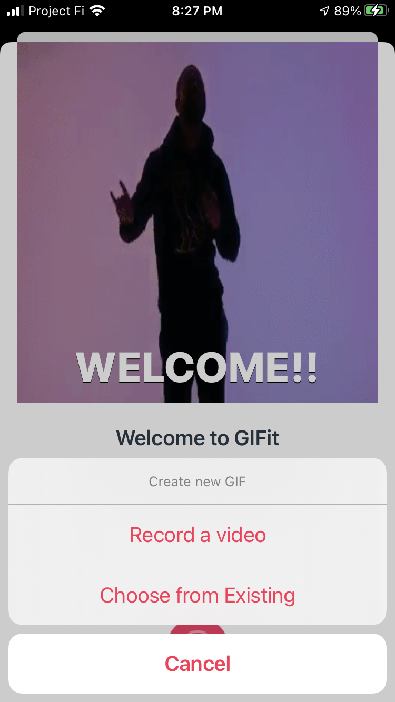

<h1 style="text-align:center;">GIFIT</h1>

   

[About](#about) 
[Features](#features) 
[Screenshots](#screenshots) 
[Technologies](#tech) 
[License](#license) 

## About

<a name = "about" /> GIFIT for iOS is the fastest, simplest way to gif animations from videos and share across all of your favorite social channels such as iMessage, Whatsapp, Facebook Messenger and more.

## Features

<a name = "features" />

- A user fiendly gif maker app. 

- Record videos or use existing videos in the media library and converts them to gif. 

- Record videos or use existing videos in the media library and converts them to gif animations.
- Shares gifs with family and friends. 
- Show the gifs in a nice compact grid layout 
- Persist gifs on the user device.  

## Screenshots

<a name = "screenshots" />
      

## Technologies 

<a name = "tech" />

- ### Language ### 

  - Swift 

- ### Frameworks ###

  - UIKit
  - Foundation
  - AVFoundation
  - MobileCoreServices
  - CoreGraphics

- ### Classes or Protocols ###

  - UICollectionView
  - Codable
  - NSKeyedArchiver
  - NSKeyedUnarchiver
  - Hashable

- ### Design Patterns ###

  - MVC
  - MVVM
  - Delegation
  - Strategy

- ### Third Party Classes ###

  - ImageIO
  - Regift

## License 

<a name = "about" /> 
GIFIT is released under the MIT license. See [LICENSE](https://github.com/shruti1512/GifMaker/blob/main/LICENSE) for details.

